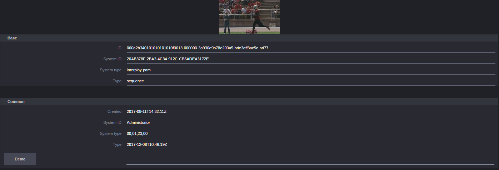

# Clip Info pane
The Clip Info pane is an example of a custom pane in MediaCentral UX using the CTMS API to display detailed data from Interplay Production. 

Once installed MediaCentral UX will have a new Pane called "Clip Info". When an Interplay Production asset is opened this pane will display two sets of data:

* Relatives: Other assets associated with this asset. For example sequences will show all clips that they use. All relatives are clickable links which can be followed.
* Files: These are the media files for the selected clips. These typically are located on NEXIS.

This example makes use of 2 Toolkits:
* Connectivity Toolkit Media Suite API: This API is used to communicate with Interplay Production and fetch the additional data.
* MediaCentral UI Toolkit: This allows for development and deployment of custom panes from MediaCentral.

Each of these APIs is described in more detail at the [Connectivity Toolkit Website](https://www.avid.com/connectivity-partner-program/connectivity-toolkit).

## Running the examples
To run these examples you will need a running MediaCentral server running MediaCentral 2.8. 

### Connectivity Toolkit Media Suite API
You need to make sure the CTMS for Interplay Production is running and working before you can try these examples. This API is included with Interplay Production 3.6 and up.

### Dependencies
To be able to build and run this example you need to download the UI Toolkit libraries from [the developer website](https://my.avid.com/products/cppsdk?toolkit=MCT). Once you've downloaded the toolkit and unzipped it, copy everything below `avid-modules` into the `modules` directory of this project. The result should look like this:

    clip-info
        modules
            avid-mcux
            avid-mcux-actions-binder
            ...
        ui
        test
        ...

### Mediacentral UI Toolkit
`ui` contains a basic view that gets the mobid of the current selection and 
loads the additional data. The pane can be run using a local proxy, allowing you to run the code locally and still work with a full MediaCentral system.

Running:
    
    npm install
    npm run build      ("npm run build-watch" if you want to keep it running)
    node node_modules/avid-mcux/lib/cli.js dev -b https://<your mediacentral server> -d -u http://<your mediacentral server>:8080 -i ./dist

## Deploying to a MediaCentral | UX server

To deploy this example project to a production MediaCentral | UX server, build it by running
`npm install && npm run build`, and then copy the `clip-info-example` folder from `dist` to the following path
on the MediaCentral | UX server:

For Media Central | UX 2.8 and newer:

    /opt/avid/share/nginx/plugins

For Media Central | UX 2.6 and 2.7:

    /opt/avid/share/avid/media-central/htdocs/plugins
